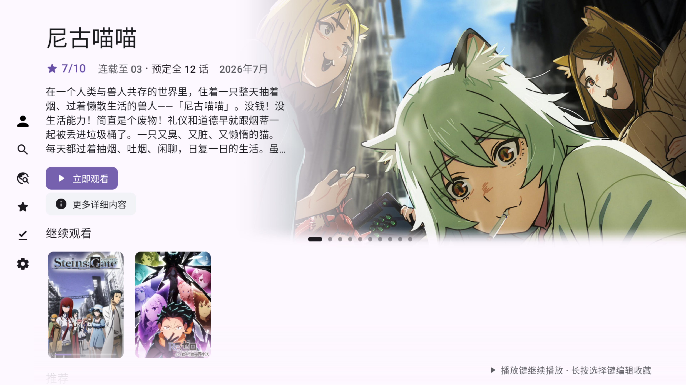
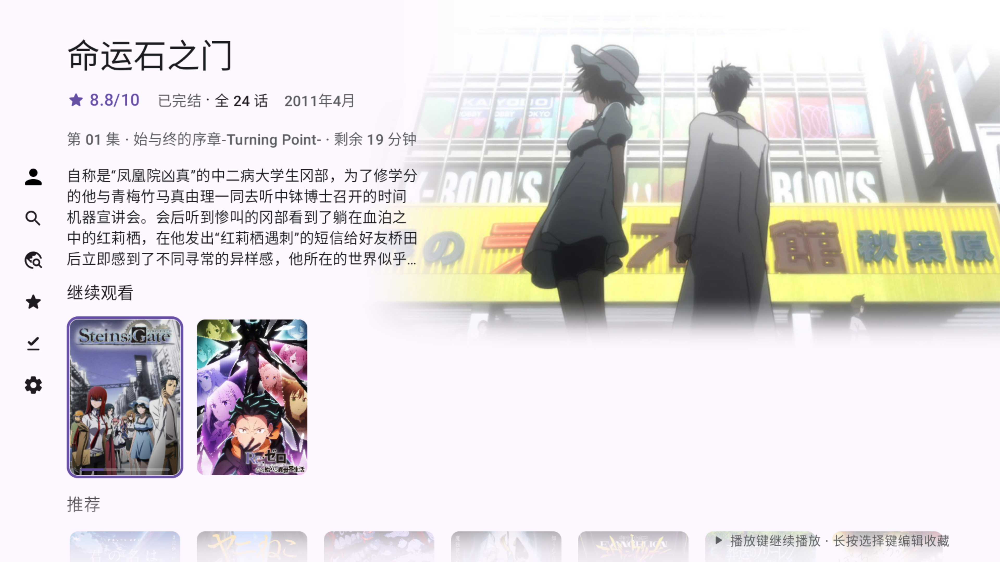
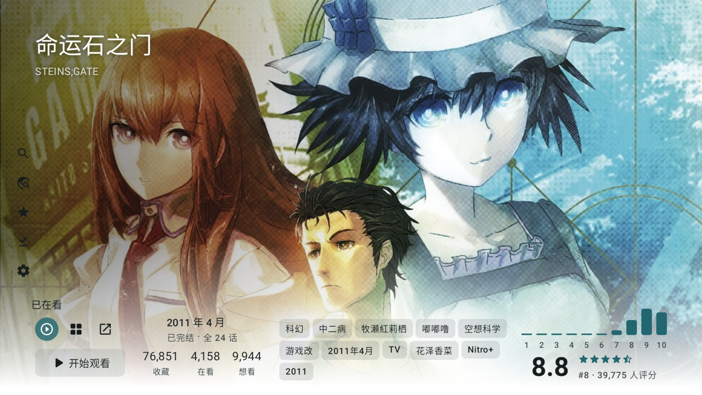
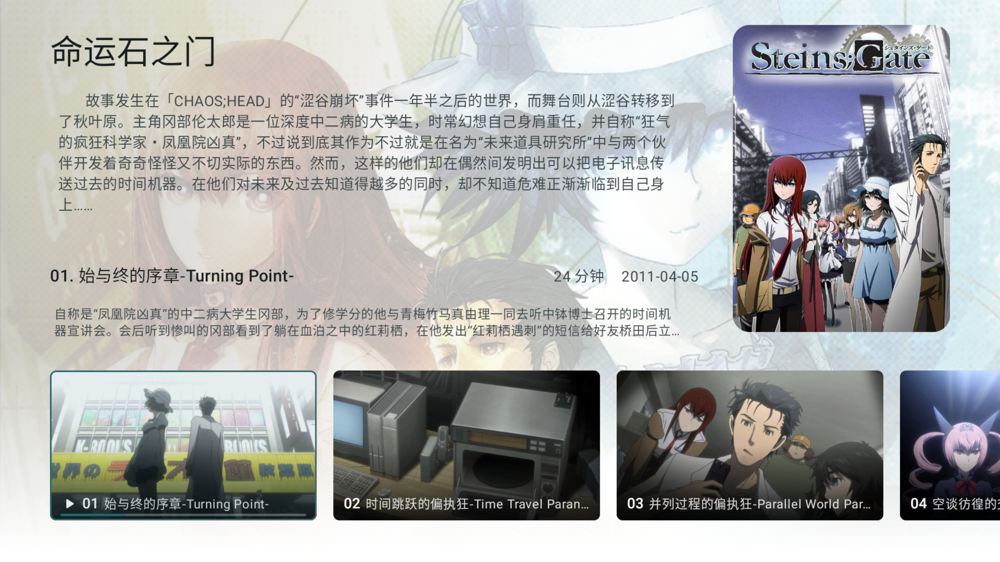
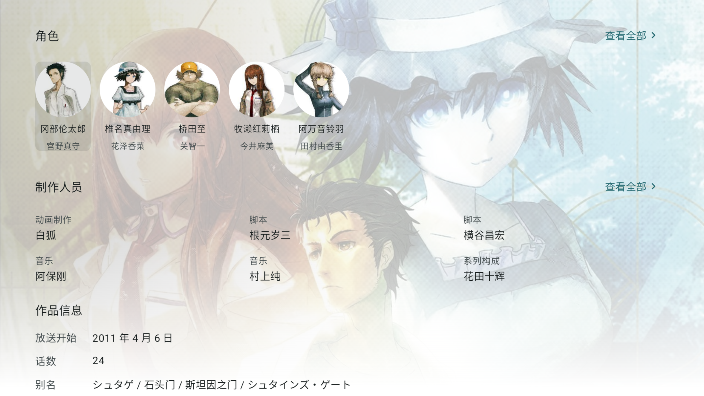
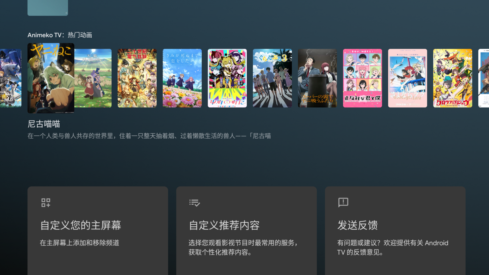

**📺 Android TV 适配版 (Fork)**

| 本仓库发布                                                                                                                                                                                                            | 原项目                                                                                                                                                                          |
|--------------------------------------------------------------------------------------------------------------------------------------------------------------------------------------------------------------|---------------------------------------------------------------------------------------------------------------------------------------------------------------------------|
|  |  |

> [!NOTE]
> 这是 [open-ani/animeko](https://github.com/open-ani/animeko) 的**第三方 Fork**，在原版功能之上增加了 **Android TV / Google TV 遥控器适配**，可在电视盒子（如 NVIDIA Shield）上用遥控器操作并在电视主屏幕显示图标。其余功能与上游保持一致，并跟随上游版本更新。下方"主要功能"为上游通用介绍，TV 相关说明请见 [📺 Android TV 版说明](#-android-tv-版说明)。

[dmhy]: http://www.dmhy.org/

[Bangumi]: http://bangumi.tv

[ddplay]: https://www.dandanplay.com/

[Compose Multiplatform]: https://www.jetbrains.com/compose-multiplatform/

[acg.rip]: https://acg.rip

[Mikan]: https://mikanani.me/

[Ikaros]: https://ikaros.run/

[Kotlin Multiplatform]: https://kotlinlang.org/docs/multiplatform.html

[ExoPlayer]: https://developer.android.com/media/media3/exoplayer

[VLC]: https://www.videolan.org/vlc/

[libtorrent]: https://libtorrent.org/

Animeko 支持云同步观看记录 ([Bangumi][Bangumi])、多视频数据源、缓存、弹幕、以及更多功能，提供尽可能简单且舒适的追番体验。

> Animeko 曾用名 Ani，现在也简称 Ani。

[立即下载](https://animeko.org/)

https://github.com/user-attachments/assets/e63636c9-30b7-411c-aa6b-e5b78b900726

## 主要功能

功能与上游一致：浏览 [Bangumi][Bangumi] 番剧信息与社区评价、新番时间表与标签搜索、云同步追番进度、聚合视频与弹幕数据源、离线缓存、多平台精美界面等。完整的功能介绍与应用截图请见[上游仓库 open-ani/animeko](https://github.com/open-ani/animeko#主要功能)。

## 📺 Android TV 版说明

本 Fork 在上游基础上完成了 Android TV 遥控器适配，并让应用图标显示在电视主屏幕（LEANBACK 启动器）上。安装后在更新 release 之后会在主页提醒，在设置里可以直接更新。

除遥控器焦点适配外，大部分页面针对电视大屏**专门重新设计**，(测试版本，未正式发布，欢迎提issue或邮件反馈)，并且支持切换为旧版（低端机可选）：

|  |
|:---------------------------------------------------------------------------------------------------:|

|  |
|:---------------------------------------------------------------------------------------------------:|

|  |
|:---------------------------------------------------------------------------------------------------:|

|  |
|:---------------------------------------------------------------------------------------------------:|

|  |
|:---------------------------------------------------------------------------------------------------:|

|  |
|:--------------------------------------------------------------------------------------:|

|  |
|:---------------------------------------------------------------------------------------------------:|

|  |
|:---------------------------------------------------------------------------------------------------:|

还提供两项电视系统级功能：

- **主屏预览频道**：电视主屏幕显示"热门动画"频道和"继续观看"行，点击卡片直达详情页（首次启动时按系统提示允许添加频道）。

|  |
|:----------------------------------------------------------------------------------------------:|

- **屏保**：轮播在看与热门动画的横版剧照，按确定键直达该动画详情页，左右键切换（需在系统设置 → 屏保中选择 Animeko）。

|  |
|:------------------------------------------------------------------------------------:|

### 下载

| 平台          | 下载                                                                                                            |
|-------------|---------------------------------------------------------------------------------------------------------------|
| Android / 电视 | [前往 Releases 下载最新版 APK](https://github.com/GrahamZen/animeko/releases/latest)（推荐 `universal` 版本） |

> 不确定架构时请直接下载 `universal` 版本。该 APK 同时适用于手机、平板和电视盒子。

> 也可前往专门的下载分发仓库 [**GrahamZen/animeko-tv-releases**](https://github.com/GrahamZen/animeko-tv-releases/releases/latest)（每日自动镜像本仓库 Release）。

### ⚠️ 系统版本要求

- **推荐 Android 11（API 30）及以上**。
- 在 **Android 10 及以下** 的系统里很可能无法正确请求焦点，导致遥控器功能不可用。遇到遥控器无法操作的问题时，请先确认系统版本。
- NVIDIA Shield 等主流电视盒子的较新系统一般可正常使用。

### 遥控器使用说明

播放时如果焦点丢失，**按住确认键**可以找回焦点（在播放器界面会回到弹幕设置按钮，其他界面会回到左上角按钮）。

遥控器按钮支持：

- 播放 / 暂停键
- 左右键控制后退 / 前进
- 上一首 / 下一首键控制上一集 / 下一集
- 确认键唤出播放器组件，再按确认键将焦点移到弹幕设置按钮

以上功能在焦点位于"播放器任意按钮的上一级"时生效；焦点在播放器中任意按钮时，按返回键回到上一级。

设置 → 数据源管理支持纯遥控器排序：在数据源条目上**长按确认键**聚焦右侧菜单按钮，**再次长按**进入排序模式，此时确认键选中 / 放下条目，上下键移动选中的条目，返回键退出。

> 最开始的登录部分如果焦点丢失，请接入鼠标完成登录，之后即可继续使用遥控器。

### 手动完成验证码页面的操作

| 操作              | 效果                                  |
|-----------------|-------------------------------------|
| 方向键             | 移动光标（先按一下方向键唤出光标）          |
| 确认键（短按）        | 在光标位置模拟触摸点击（用于通过验证码）      |
| 确认键（长按 ~500ms） | 点击"✓"（大部分情况通过验证码后会自动关闭）  |
| 返回键             | 取消，关闭对话框                          |

### 已知问题

- 右侧数据源侧边栏可能出现按返回键不关闭等问题，建议只使用播放器内的"选择数据源"按钮。
- 在 Android 10 及以下系统中可能无法正确请求焦点，从而无法使用遥控器功能（见上方系统版本要求）。

## 下载（其他平台）

> 以下为上游通用平台说明。本 Fork 主要针对 Android / 电视分发，其他平台请直接使用[上游 Animeko](https://github.com/open-ani/animeko)。

Animeko 支持所有主流平台：Android、iOS、Windows、macOS、Linux。

- 稳定版本: 功能稳定  
  [下载稳定版本](https://animeko.org/downloads/)

通常建议使用稳定版本. 如果你愿意参与测试并拥有一定的对 bug 的处理能力, 也欢迎使用测试版本更快体验新功能.
具体版本类型可查看下方.

- 测试版本: 体验最新功能  
  [下载测试版本](https://animeko.org/downloads/)

## 技术总览

如果你是开发者，我们总是欢迎你提交 PR 参与开发！
以下几点可以给你一个技术上的大概了解。

- [Kotlin 多平台][Kotlin Multiplatform]架构；
- 使用新一代响应式 UI 框架 [Compose Multiplatform][Compose Multiplatform] 构建
  UI；
- 内置专为 Animeko 打造的“基于 [libtorrent][libtorrent] 的 BitTorrent 引擎，优化边下边播的体验；
- 高性能弹幕引擎，公益弹幕服务器 + 网络弹幕源；
- 适配多平台的[视频播放器](https://github.com/open-ani/mediamp)，Android 底层为 [ExoPlayer][ExoPlayer]，PC 底层为 [VLC][VLC]；
- 多类型数据源适配，内置 [动漫花园][dmhy]、[Mikan]，拥有强大的自定义数据源编辑器和自动数据源选择器。

### 参与开发

欢迎你提交 PR 参与开发，
有关项目技术细节请参考 [CONTRIBUTING](docs/contributing/README.md)。

## FAQ

### 资源来源是什么?

全部视频数据都来自网络, Animeko 本身不存储任何视频数据。
Animeko 支持两大数据源类型：BT 和在线。BT 源即为公共 BitTorrent P2P 网络，
每个在 BT
网络上的人都可分享自己拥有的资源供他人下载。在线源即为其他视频资源网站分享的内容，目前使用 [creamycake ani-subs](https://github.com/creamycake-anime/ani-subs)。Animeko
本身并不提供任何视频资源。

本着互助精神，使用 BT 源时 Animeko 会自动做种 (分享数据)。
BT 指纹为 `-AL4123-`，其中 `4123` 为版本号 `4.12.3`；UA 为类似 `ani_libtorrent/4.12.3`。

### 弹幕来源是什么?

Animeko 拥有自己的公益弹幕服务器，在 Animeko 应用内发送的弹幕将会发送到弹幕服务器上。每条弹幕都会以
Bangumi
用户名绑定以防滥用（并考虑未来增加举报和屏蔽功能）。

Animeko 还会从[弹弹play][ddplay]获取关联弹幕，弹弹play还会从其他弹幕平台例如哔哩哔哩港澳台和巴哈姆特获取弹幕。
番剧每集可拥有几十到几千条不等的弹幕量。
